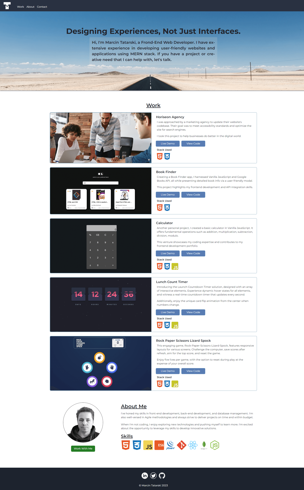

# Marcin Tatarski - Boostrap Portfolio Website

## Description

Welcome to my portfolio website, the latest updated version where I passionately showcase my expertise in front-end web development. With a particular emphasis on crafting user-friendly web applications using React and seamlessly integrating databases, I've harnessed the power of Bootstrap to enhance the experience.

As a dedicated web developer, my mission is to create exceptional user experiences through innovative web technologies. Join me on this journey as I explore the limitless possibilities of front-end development with the added versatility of Bootstrap.

## About Me

Hi there, I'm Marcin, a passionate self-taught web developer.

I have extensive experience in developing user-friendly websites and applications using the latest web technologies, such as the MERN stack. I've honed my skills in front-end development, back-end development, and database management. I'm also well-versed in Agile methodologies and always strive to deliver projects on time and within budget.

My goal is to advance my career in front-end development, contributing to innovative projects and collaborating with like-minded professionals. I'm excited to connect with potential employers, clients, and fellow developers who share my enthusiasm for creating outstanding web experiences.

## Screenshot

*This is the main page of my portfolio, featuring a showcase of my most recent work, an 'About Me' section, and a way to get in touch with me.*

## Usage

To access and view my portfolio website, you can follow these simple steps:

1. Open a web browser.

2. Navigate to the following URL: https://martindocs-bootcamp.github.io/mtatarski-bootstrap-portfolio/

3. Explore the various sections, including 'Work', 'About Me', and 'Contact Me', to learn more about my skills and projects.

Feel free to reach out to me if you have any questions or if you'd like to discuss potential collaboration or job opportunities. Thank you for visiting my portfolio!

## Credits

N/A (No contributors at this time).

## License

Please refer to the [LICENSE](./LICENSE.md) file in this repository for details on how this project is licensed.
